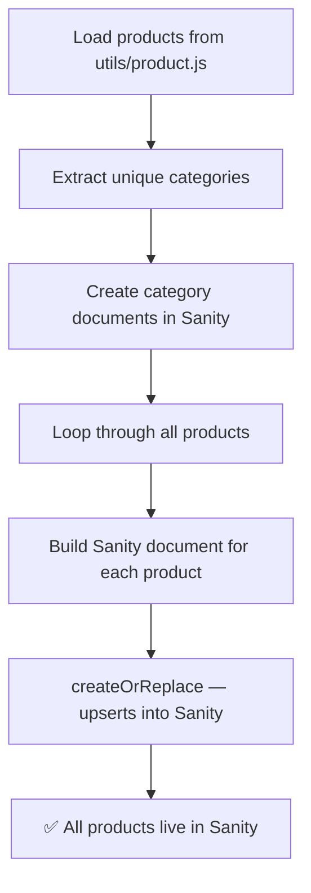

# Biolexa

# Bulk Import All Products into Sanity — Step-by-Step Guide

## ✅ What You Already Have

You're in great shape! Your project already contains:

| Component | File | Status |
|---|---|---|
| Product data (48 products) | [product.js](file:///Users/vavinash/Desktop/work/biolexa/Biolexa/utils/product.js) | ✅ Ready |
| Sanity product schema | [product.ts](file:///Users/vavinash/Desktop/work/biolexa/Biolexa/sanity/schemaTypes/product.ts) | ✅ Ready |
| Category schema | [productCategory.ts](file:///Users/vavinash/Desktop/work/biolexa/Biolexa/sanity/schemaTypes/productCategory.ts) | ✅ Ready |
| Migration script | [migrate-products.js](file:///Users/vavinash/Desktop/work/biolexa/Biolexa/scripts/migrate-products.js) | ✅ Ready |
| Sanity Write Token | [.env](file:///Users/vavinash/Desktop/work/biolexa/Biolexa/.env) (line 10) | ✅ Configured |

---

## 🚀 Steps to Bulk Import All Products

### Step 1 — Verify Your Write Token

Your `.env` already has `SANITY_API_WRITE_TOKEN` set. Make sure the token has **Editor** or higher permissions in your Sanity project dashboard.

> [!TIP]
> To check/manage tokens: Go to [manage.sanity.io](https://manage.sanity.io) → Your Project → **API** → **Tokens**

---

### Step 2 — Run the Migration Script

Open your terminal in the project root and run:

```bash
node scripts/migrate-products.js
```

This single command will:
1. Load all **48 products** from `utils/product.js`
2. Create **product categories** (Orals, Skin Range, etc.) automatically
3. Create all **product documents** with deterministic IDs (`product-1`, `product-2`, etc.)
4. Link each product to its category via a Sanity reference

---

### Step 3 — Verify in Sanity Studio

After the script finishes, open your Sanity Studio at:

```
http://localhost:3000/studio
```

Navigate to **Products Catalog** — you should see all products listed.

---

## 📋 What the Script Does (Behind the Scenes)



**Key details:**
- Uses `createOrReplace` — safe to run multiple times without duplicates
- Generates deterministic IDs (`product-{Id}`) so re-running won't create duplicates
- Maps every field from your data: Name, Composition, Category, Sub-category, Packing, MRP, Image links, etc.

---

## ⚠️ If You Hit Errors

| Error | Fix |
|---|---|
| `Missing SANITY_API_WRITE_TOKEN` | Add/verify the token in your `.env` file |
| `403 Insufficient permissions` | Token needs **Editor** role — update in [manage.sanity.io](https://manage.sanity.io) |
| `Module not found: @sanity/client` | Run `pnpm add @sanity/client` |
| `utils/product.js not found` | The script expects the file at `utils/product.js` — it's already there |

---

## 🔄 Re-running is Safe

Since the script uses `createOrReplace` with deterministic IDs, you can safely re-run it anytime to update products (e.g., after editing `product.js`). It won't create duplicates.
